# Architecture

PF2e Dungeon Crawl is a GM-less-capable dungeon-crawl subsystem for
Pathfinder 2E: procedurally sequenced rooms, encounter generation, traps,
puzzles, skill challenges and combat AI, driven by a swappable generator
interface (`module.json`'s own description). This doc is a living view of
how the ~40 files under `scripts/` and `tools/agent-service/` relate to each
other — see "Keeping this current" below for how it stays that way. The
point-in-time feature specs under `docs/superpowers/specs/` remain useful
for *why* a given design was chosen, but they document history, not
today's shape; this doc documents today's shape.

## The pure-logic / Foundry-glue pairing convention

The single most important structural fact about this codebase: nearly
every room-kind mechanic is split into two files, repeated deliberately
across the module rather than being a one-off pattern:

- A **pure-logic** file with no Foundry dependency at all — plain
  functions over plain data, fully unit-testable without a live world.
  `dungeon-deck.mjs`, `trap-mechanics.mjs`, `puzzle-mechanics.mjs`,
  `skill-challenge-mechanics.mjs`, `treasure.mjs`, `agent-candidates.mjs`,
  `combat-rewards.mjs`, `dungeon-follow-mechanics.mjs`, `cover-items.mjs`,
  `encounter-deck.mjs`, and `dungeon-layout.mjs` are all this shape.
- A **Foundry-glue** file that touches `game`/`Actor`/`ChatMessage`/`Scene`
  and calls into its pure sibling for the actual decision logic.
  `dungeon-scene.mjs`, `trap-combat.mjs`, `puzzle.mjs`,
  `skill-challenge.mjs`, `dungeon-combat.mjs`, `foundry-api.mjs`,
  `dungeon-follow.mjs`, and `scripts/ui/dungeon-app.mjs` are this shape.

This split matters for anyone touching test coverage: the pure-logic half
of a pair is thoroughly unit-tested (dozens of `tests/*.test.mjs` files
exist for exactly these), while the Foundry-glue half generally has **no**
unit test coverage at all — `dungeon-scene.mjs`, `trap-combat.mjs`, and
`scripts/ui/dungeon-app.mjs` each have zero tests, confirmed while fixing
issues #56, #60, and #65 in this same repo. That's not an oversight to
fix; it's the accepted cost of the split. A change to glue-layer behavior
gets verified by direct code review and, where possible, against a live
Foundry world via the `foundry-rest` skill — not by adding a mock-heavy
unit test that would mostly just be testing the mock.

## Subsystems

**Dungeon generation / sequencing** (`dungeon-deck.mjs`,
`dungeon-layout.mjs`, `prng.mjs`) — the abstract room sequence (kind,
order, which setpiece each room draws) and the grid-unit room geometry,
both fully deterministic from a seed, both Foundry-free.

**Foundry scene building** (`dungeon-scene.mjs`, `foundry-api.mjs`,
`placement.mjs`, `data-loader.mjs`, `dungeon-sound.mjs`/`audio.mjs`) —
turns the abstract sequence into a real Foundry `Scene`: walls, floor art,
reveal doors, and (lazily, one room at a time as the party reaches each
door) each room's actual spawned content.

**Encounter generation** (`encounter-generator.mjs`, `encounter-deck.mjs`,
`encounter-roster.mjs`, `generator-registry.mjs`, `default-generator.mjs`,
`creature-art.mjs`, `trait-picker.mjs`, `cover-items.mjs`) — the abstract
Encounter Deck (level-relative math, no bestiary knowledge) resolved
against the live PF2e bestiary into real creatures, behind a swappable
`generator-registry.mjs` contract so another module could supply its own
sequencing/roster logic without this one caring.

**Combat automation** (`dungeon-combat.mjs`, `combat-rewards.mjs`,
`agent-candidates.mjs`, `dungeon-strike-riders.mjs`,
`dungeon-critical-deck.mjs`) — wires a spawned encounter into a real PF2e
`Combat`, and auto-applies whatever Critical Hit/Fumble Deck directives
parse cleanly. For an `agentControlled` combatant's turn,
`autoPlayCombatantTurnIfDue` races two things: `armAgentTimeout` (a pure
safety-net timeout, unchanged since before this subsystem existed) against
`runAgentDecisionLoop`, an in-process decide-apply loop that calls the
hosted agent service (below) directly over `fetch()`. If the service
doesn't answer in time, errors, or isn't configured, the timeout fires and
`playHeuristicTurn` (pure candidate-scoring logic, no LLM) takes the turn
instead — the module always has a working fallback with no hardcoded LLM
dependency of its own.

**Hosted agent service** (`scripts/agent-service-client.mjs`,
`scripts/dungeon-customization-fulfillment.mjs`,
`tools/agent-service/*`) — replaces what used to be an external polling
process (`tools/agent-loop/poll.mjs`) and an interactive-MCP-session flow
(`tools/agent-loop/mcp-server.mjs`); both are retired. `tools/agent-service/`
is a persistent, self-hosted `node:http` service (`server.mjs`, wrapping
the `providers/litellm.mjs`/`providers/laya.mjs` adapters and
`customization-generator.mjs`) that talks to a sidecar `litellm` proxy
(deployed alongside it via `docker-compose.yml`) rather than any model
provider directly. `providers/litellm.mjs` and `customization-generator.mjs`
both route requests through the shared `node-fetch.mjs` transport and pick
a model tier (`fast` vs `reasoning`, litellm's own aliases, configured in
`litellm-config.yaml`) via the pure `tier-selection.mjs` classifier —
`litellm` is the default combat-decision provider, `laya` remains
selectable via `PF2EDC_AGENT_PROVIDER=laya`. Exposes `GET /v1/health`,
`POST /v1/combat-decision`, and `POST /v1/flavor-customization` behind a
bearer token. Foundry's own client-side code calls it directly — no relay,
no local process a GM has to keep alive — via
`scripts/agent-service-client.mjs` (a thin fetch wrapper) from two call
sites: `dungeon-combat.mjs`'s `runAgentDecisionLoop` (combat decisions, see
above) and `scripts/dungeon-customization-fulfillment.mjs`'s
`fulfillPendingCustomizations` (fire-and-forget trap/skill-challenge/
puzzle/narrative flavor text, called from `ui/dungeon-app.mjs`'s
`populateNextRoom` the moment a room's content becomes pending, rather than
waiting on an interactive session to check in).

**Puzzle / trap / skill-challenge / treasure mechanics**
(`puzzle-mechanics.mjs`+`puzzle.mjs`,
`trap-mechanics.mjs`+`trap-combat.mjs`+`trap-library.mjs`,
`skill-challenge-mechanics.mjs`+`skill-challenge.mjs`, `treasure.mjs`,
`narrative-mechanics.mjs`) — one pure/glue pair per room-kind mechanic
(see the convention above), each built from real PF2e compendium content
(`pf2e.hazards`, `pf2e.rollable-tables`) rather than inventing new game
data.

**GM-less relay & permissions** (`dungeon-remote.mjs`,
`dungeon-permissions.mjs`, `player-choice.mjs`, `choice-prompts.mjs`) —
every mutating dungeon-crawl action still only ever runs on a genuinely
GM-privileged client (a human GM, or a client logged in as the world's
"Agent" GM account). `dungeon-permissions.mjs` decides whether a client
should render interactive vs. read-only and whether a routed request
should be honored; `dungeon-remote.mjs` is the actual relay — a non-GM
host's client calls `requestDungeonAction(actionName, args)`, which
socket-emits a request that only a GM-privileged client picks up,
executes, and acks back. Nearly every mutating action in `dungeon-app.mjs`
already routes through this. `dungeon-follow.mjs` didn't, until #65 fixed
it today — see Party-follow below.

**Party-follow** (`dungeon-follow.mjs`, `dungeon-follow-mechanics.mjs`) —
moves AI-controlled party members toward the leader's token between
fights. The pure half computes a single step of pathfinding-aware
movement; the glue half hooks `updateToken`/`updateWall` and, since #65,
falls back to the GM-less relay above when the client reacting to the
hook isn't itself GM-privileged but is the run's own host.

**Run state & UI** (`dungeon-runner.mjs`, `module.mjs`,
`scripts/ui/dungeon-app.mjs`, `world-macros.mjs`) — `dungeon-runner.mjs`
reads/writes the `dungeonRuns` world setting (the durable record of an
in-progress run); `module.mjs` is the Foundry module's own entry point
(hook registration, `game.modules.get(...).api` surface); `dungeon-app.mjs`
is the player/GM-facing `Application` that renders the tracker and
dispatches every user action either directly (GM) or through the relay
(non-GM host); `world-macros.mjs` (split out of `module.mjs` in #96) owns
`MACRO_DEFS` and `ensureWorldMacros()`, creating/renaming this module's
world macros in place by matching on their own `flags.<MODULE_ID>.generated`
marker rather than by (renameable) name — small and isolated enough from
the rest of `module.mjs`'s heavy import graph to carry real unit test
coverage despite touching `game.macros`/`Macro`.

## Dependency graph

Generated by `node tools/generate-architecture-graph.mjs` (also `npm run
architecture:graph`) from the actual current `import` statements under
`scripts/` and `tools/agent-service/` — regenerate and paste over the block
below any time the graph might have changed, rather than hand-editing it.

```mermaid
graph LR
  subgraph "Hosted agent service (combat AI + flavor customization)"
    scripts_agent_service_client_mjs["agent-service-client.mjs"]
    scripts_dungeon_customization_fulfillment_mjs["dungeon-customization-fulfillment.mjs"]
    tools_agent_service_customization_generator_mjs["agent-service/customization-generator.mjs"]
    tools_agent_service_entrypoint_mjs["agent-service/entrypoint.mjs"]
    tools_agent_service_env_mjs["agent-service/env.mjs"]
    tools_agent_service_node_fetch_mjs["agent-service/node-fetch.mjs"]
    tools_agent_service_providers_index_mjs["agent-service/providers/index.mjs"]
    tools_agent_service_providers_laya_mjs["agent-service/providers/laya.mjs"]
    tools_agent_service_providers_litellm_mjs["agent-service/providers/litellm.mjs"]
    tools_agent_service_server_mjs["agent-service/server.mjs"]
    tools_agent_service_tier_selection_mjs["agent-service/tier-selection.mjs"]
  end
  subgraph "GM-less relay & permissions"
    scripts_choice_prompts_mjs["choice-prompts.mjs"]
    scripts_dungeon_permissions_mjs["dungeon-permissions.mjs"]
    scripts_dungeon_remote_mjs["dungeon-remote.mjs"]
    scripts_player_choice_mjs["player-choice.mjs"]
  end
  subgraph "Party-follow"
    scripts_dungeon_follow_mechanics_mjs["dungeon-follow-mechanics.mjs"]
    scripts_dungeon_follow_mjs["dungeon-follow.mjs"]
  end
  subgraph "Combat automation (in-module heuristic)"
    scripts_agent_candidates_mjs["agent-candidates.mjs"]
    scripts_combat_rewards_mjs["combat-rewards.mjs"]
    scripts_dungeon_combat_mjs["dungeon-combat.mjs"]
    scripts_dungeon_critical_deck_mjs["dungeon-critical-deck.mjs"]
    scripts_dungeon_strike_riders_mjs["dungeon-strike-riders.mjs"]
  end
  subgraph "Puzzle / trap / skill-challenge / treasure mechanics"
    scripts_narrative_mechanics_mjs["narrative-mechanics.mjs"]
    scripts_puzzle_mechanics_mjs["puzzle-mechanics.mjs"]
    scripts_puzzle_mjs["puzzle.mjs"]
    scripts_skill_challenge_mechanics_mjs["skill-challenge-mechanics.mjs"]
    scripts_skill_challenge_mjs["skill-challenge.mjs"]
    scripts_trap_combat_mjs["trap-combat.mjs"]
    scripts_trap_library_mjs["trap-library.mjs"]
    scripts_trap_mechanics_mjs["trap-mechanics.mjs"]
    scripts_treasure_mjs["treasure.mjs"]
  end
  subgraph "Encounter generation"
    scripts_cover_items_mjs["cover-items.mjs"]
    scripts_creature_art_mjs["creature-art.mjs"]
    scripts_default_generator_mjs["default-generator.mjs"]
    scripts_encounter_deck_mjs["encounter-deck.mjs"]
    scripts_encounter_generator_mjs["encounter-generator.mjs"]
    scripts_encounter_roster_mjs["encounter-roster.mjs"]
    scripts_generator_registry_mjs["generator-registry.mjs"]
    scripts_trait_picker_mjs["trait-picker.mjs"]
  end
  subgraph "Dungeon generation / sequencing"
    scripts_dungeon_deck_mjs["dungeon-deck.mjs"]
    scripts_dungeon_layout_mjs["dungeon-layout.mjs"]
    scripts_prng_mjs["prng.mjs"]
  end
  subgraph "Foundry scene building"
    scripts_audio_mjs["audio.mjs"]
    scripts_data_loader_mjs["data-loader.mjs"]
    scripts_dungeon_scene_mjs["dungeon-scene.mjs"]
    scripts_dungeon_sound_mjs["dungeon-sound.mjs"]
    scripts_foundry_api_mjs["foundry-api.mjs"]
    scripts_placement_mjs["placement.mjs"]
  end
  subgraph "Run state & UI"
    scripts_dungeon_runner_mjs["dungeon-runner.mjs"]
    scripts_module_mjs["module.mjs"]
    scripts_ui_dungeon_app_mjs["ui/dungeon-app.mjs"]
    scripts_world_macros_mjs["world-macros.mjs"]
  end
  subgraph "Other"
    scripts_pathfinding_mjs["pathfinding.mjs"]
  end
  scripts_combat_rewards_mjs --> scripts_encounter_roster_mjs
  scripts_cover_items_mjs --> scripts_prng_mjs
  scripts_default_generator_mjs --> scripts_dungeon_deck_mjs
  scripts_default_generator_mjs --> scripts_encounter_roster_mjs
  scripts_dungeon_combat_mjs --> scripts_foundry_api_mjs
  scripts_dungeon_combat_mjs --> scripts_dungeon_runner_mjs
  scripts_dungeon_combat_mjs --> scripts_combat_rewards_mjs
  scripts_dungeon_combat_mjs --> scripts_agent_candidates_mjs
  scripts_dungeon_combat_mjs --> scripts_pathfinding_mjs
  scripts_dungeon_combat_mjs --> scripts_placement_mjs
  scripts_dungeon_combat_mjs --> scripts_treasure_mjs
  scripts_dungeon_combat_mjs --> scripts_cover_items_mjs
  scripts_dungeon_combat_mjs --> scripts_dungeon_sound_mjs
  scripts_dungeon_combat_mjs --> scripts_dungeon_strike_riders_mjs
  scripts_dungeon_combat_mjs --> scripts_dungeon_critical_deck_mjs
  scripts_dungeon_combat_mjs --> scripts_agent_service_client_mjs
  scripts_dungeon_customization_fulfillment_mjs --> scripts_agent_service_client_mjs
  scripts_dungeon_customization_fulfillment_mjs --> scripts_trap_combat_mjs
  scripts_dungeon_customization_fulfillment_mjs --> scripts_dungeon_runner_mjs
  scripts_dungeon_deck_mjs --> scripts_prng_mjs
  scripts_dungeon_deck_mjs --> scripts_treasure_mjs
  scripts_dungeon_follow_mechanics_mjs --> scripts_pathfinding_mjs
  scripts_dungeon_follow_mechanics_mjs --> scripts_placement_mjs
  scripts_dungeon_follow_mjs --> scripts_dungeon_runner_mjs
  scripts_dungeon_follow_mjs --> scripts_dungeon_remote_mjs
  scripts_dungeon_follow_mjs --> scripts_pathfinding_mjs
  scripts_dungeon_follow_mjs --> scripts_placement_mjs
  scripts_dungeon_follow_mjs --> scripts_dungeon_follow_mechanics_mjs
  scripts_dungeon_layout_mjs --> scripts_prng_mjs
  scripts_dungeon_remote_mjs --> scripts_player_choice_mjs
  scripts_dungeon_remote_mjs --> scripts_dungeon_runner_mjs
  scripts_dungeon_remote_mjs --> scripts_dungeon_permissions_mjs
  scripts_dungeon_remote_mjs --> scripts_ui_dungeon_app_mjs
  scripts_dungeon_remote_mjs --> scripts_dungeon_scene_mjs
  scripts_dungeon_remote_mjs --> scripts_dungeon_follow_mjs
  scripts_dungeon_runner_mjs --> scripts_generator_registry_mjs
  scripts_dungeon_runner_mjs --> scripts_skill_challenge_mechanics_mjs
  scripts_dungeon_runner_mjs --> scripts_puzzle_mechanics_mjs
  scripts_dungeon_scene_mjs --> scripts_dungeon_layout_mjs
  scripts_dungeon_scene_mjs --> scripts_placement_mjs
  scripts_dungeon_scene_mjs --> scripts_encounter_generator_mjs
  scripts_dungeon_scene_mjs --> scripts_dungeon_runner_mjs
  scripts_dungeon_scene_mjs --> scripts_dungeon_deck_mjs
  scripts_dungeon_scene_mjs --> scripts_dungeon_combat_mjs
  scripts_dungeon_scene_mjs --> scripts_dungeon_sound_mjs
  scripts_dungeon_scene_mjs --> scripts_data_loader_mjs
  scripts_dungeon_scene_mjs --> scripts_skill_challenge_mechanics_mjs
  scripts_dungeon_scene_mjs --> scripts_narrative_mechanics_mjs
  scripts_dungeon_scene_mjs --> scripts_foundry_api_mjs
  scripts_dungeon_scene_mjs --> scripts_trap_library_mjs
  scripts_dungeon_scene_mjs --> scripts_prng_mjs
  scripts_dungeon_sound_mjs --> scripts_audio_mjs
  scripts_encounter_deck_mjs --> scripts_prng_mjs
  scripts_encounter_generator_mjs --> scripts_foundry_api_mjs
  scripts_encounter_generator_mjs --> scripts_encounter_deck_mjs
  scripts_encounter_generator_mjs --> scripts_generator_registry_mjs
  scripts_encounter_generator_mjs --> scripts_data_loader_mjs
  scripts_encounter_generator_mjs --> scripts_creature_art_mjs
  scripts_encounter_generator_mjs --> scripts_trait_picker_mjs
  scripts_encounter_generator_mjs --> scripts_dungeon_combat_mjs
  scripts_encounter_generator_mjs --> scripts_cover_items_mjs
  scripts_encounter_generator_mjs --> scripts_dungeon_runner_mjs
  scripts_foundry_api_mjs --> scripts_placement_mjs
  scripts_foundry_api_mjs --> scripts_prng_mjs
  scripts_foundry_api_mjs --> scripts_cover_items_mjs
  scripts_foundry_api_mjs --> scripts_trap_combat_mjs
  scripts_foundry_api_mjs --> scripts_treasure_mjs
  scripts_foundry_api_mjs --> scripts_combat_rewards_mjs
  scripts_module_mjs --> scripts_encounter_generator_mjs
  scripts_module_mjs --> scripts_ui_dungeon_app_mjs
  scripts_module_mjs --> scripts_dungeon_runner_mjs
  scripts_module_mjs --> scripts_dungeon_permissions_mjs
  scripts_module_mjs --> scripts_dungeon_remote_mjs
  scripts_module_mjs --> scripts_dungeon_scene_mjs
  scripts_module_mjs --> scripts_dungeon_combat_mjs
  scripts_module_mjs --> scripts_dungeon_follow_mjs
  scripts_module_mjs --> scripts_trap_combat_mjs
  scripts_module_mjs --> scripts_generator_registry_mjs
  scripts_module_mjs --> scripts_default_generator_mjs
  scripts_module_mjs --> scripts_world_macros_mjs
  scripts_player_choice_mjs --> scripts_choice_prompts_mjs
  scripts_puzzle_mechanics_mjs --> scripts_skill_challenge_mechanics_mjs
  scripts_skill_challenge_mechanics_mjs --> scripts_prng_mjs
  scripts_skill_challenge_mechanics_mjs --> scripts_dungeon_deck_mjs
  scripts_trap_combat_mjs --> scripts_trap_mechanics_mjs
  scripts_trap_combat_mjs --> scripts_dungeon_runner_mjs
  scripts_ui_dungeon_app_mjs --> scripts_data_loader_mjs
  scripts_ui_dungeon_app_mjs --> scripts_dungeon_runner_mjs
  scripts_ui_dungeon_app_mjs --> scripts_dungeon_permissions_mjs
  scripts_ui_dungeon_app_mjs --> scripts_dungeon_remote_mjs
  scripts_ui_dungeon_app_mjs --> scripts_dungeon_customization_fulfillment_mjs
  scripts_ui_dungeon_app_mjs --> scripts_dungeon_deck_mjs
  scripts_ui_dungeon_app_mjs --> scripts_foundry_api_mjs
  scripts_ui_dungeon_app_mjs --> scripts_encounter_roster_mjs
  scripts_ui_dungeon_app_mjs --> scripts_skill_challenge_mjs
  scripts_ui_dungeon_app_mjs --> scripts_puzzle_mjs
  scripts_ui_dungeon_app_mjs --> scripts_skill_challenge_mechanics_mjs
  scripts_ui_dungeon_app_mjs --> scripts_trait_picker_mjs
  scripts_ui_dungeon_app_mjs --> scripts_dungeon_scene_mjs
  scripts_ui_dungeon_app_mjs --> scripts_dungeon_combat_mjs
  tools_agent_service_customization_generator_mjs --> tools_agent_service_node_fetch_mjs
  tools_agent_service_customization_generator_mjs --> tools_agent_service_env_mjs
  tools_agent_service_customization_generator_mjs --> tools_agent_service_tier_selection_mjs
  tools_agent_service_entrypoint_mjs --> tools_agent_service_server_mjs
  tools_agent_service_entrypoint_mjs --> tools_agent_service_env_mjs
  tools_agent_service_providers_index_mjs --> tools_agent_service_env_mjs
  tools_agent_service_providers_index_mjs --> tools_agent_service_providers_litellm_mjs
  tools_agent_service_providers_index_mjs --> tools_agent_service_providers_laya_mjs
  tools_agent_service_providers_laya_mjs --> tools_agent_service_env_mjs
  tools_agent_service_providers_litellm_mjs --> tools_agent_service_env_mjs
  tools_agent_service_providers_litellm_mjs --> tools_agent_service_node_fetch_mjs
  tools_agent_service_providers_litellm_mjs --> tools_agent_service_tier_selection_mjs
  tools_agent_service_server_mjs --> tools_agent_service_providers_index_mjs
  tools_agent_service_server_mjs --> tools_agent_service_customization_generator_mjs
  tools_agent_service_server_mjs --> tools_agent_service_env_mjs
  tools_agent_service_tier_selection_mjs --> tools_agent_service_env_mjs
```

Notably, `tools/agent-service/*` never imports anything from `scripts/`,
and `scripts/agent-service-client.mjs` never imports anything from
`tools/agent-service/*` either — the two only ever talk over HTTP
(`fetch()` against the service's `/v1/*` routes), never by sharing code.
This is the reverse of the old relay-based direction: previously an
external `tools/agent-loop/*` process reached *into* a live Foundry world
via the `foundry-rest` relay; now Foundry's own client-side code reaches
*out* to the self-hosted service it configures via the `agentServiceUrl`/
`agentServiceApiKey` module settings.

### Two intentional circular imports

`dungeon-follow.mjs` ⟷ `dungeon-remote.mjs` and `scripts/ui/dungeon-app.mjs`
⟷ `dungeon-remote.mjs` both import each other. This is deliberate, not a
mistake: `dungeon-remote.mjs`'s relay needs to call back into the actual
action functions it dispatches to (`dungeon-app.mjs`'s room-resolution
handlers, `dungeon-follow.mjs`'s `runFollowMoveNow`), while those same
files need `dungeon-remote.mjs`'s `requestDungeonAction` to ask a
GM-privileged client to run one of those actions on their behalf. Both
pairs work correctly under this codebase's ESM/Vitest setup because all
circular usage happens inside function bodies, never at module-evaluation
time.

## Keeping this current

Run the `update-architecture-docs` skill (`.claude/skills/update-architecture-docs/`)
as part of the same per-merge discipline this repo's `CLAUDE.md` already
requires for the `module.json` version bump: whoever merges bumps the
version *and* refreshes this doc, in the same pass. The skill regenerates
the dependency graph above mechanically (`tools/generate-architecture-graph.mjs`)
and prompts a check of whether the subsystem groupings and prose still
describe reality — the script only catches graph drift, not prose drift.
